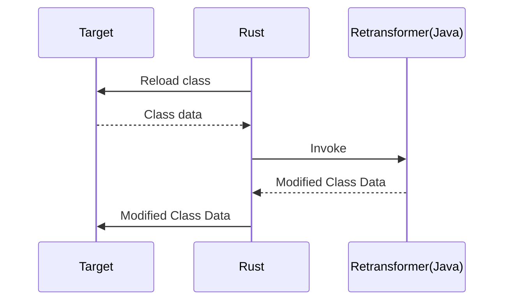

# jvm-injection-template

This allows you to dynamically modify the behavior of your Java application.

By default, it is modified in Minecraft 1.8.9 to always have health 20.0.

## How to build

```bash
# clone repository
git clone 
cd jvm-injection-template

# build tiny-remapper
cd tiny-remapper
./gradlew shadowJar
cd ..

# build java side program
cd b_client
./gradlew shadowJar
cd ..

# build rust side program
cd b_agent
cargo build --release # target/release/b_agent.dll
cd ..
```

## How it works

This works by modifying the data of the class using the JVMTI class file load hook.
The logic for modifying raw class data is used using Objectweb ASM.
If ASM might be difficult to handle, you can use Bytekin.



## License

This project is licensed under the `GNU AGPL-3.0`. No later version is allowed.

Read the file `LICENSE` for more information.
